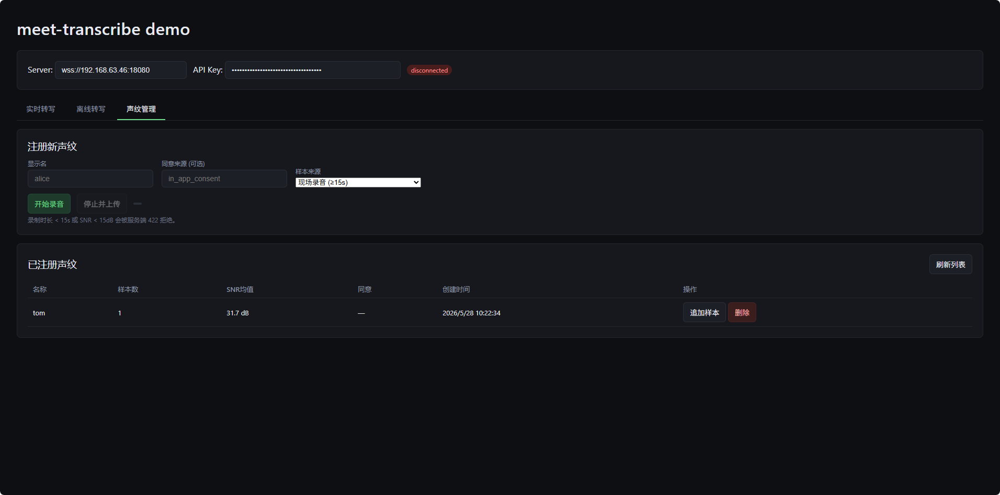
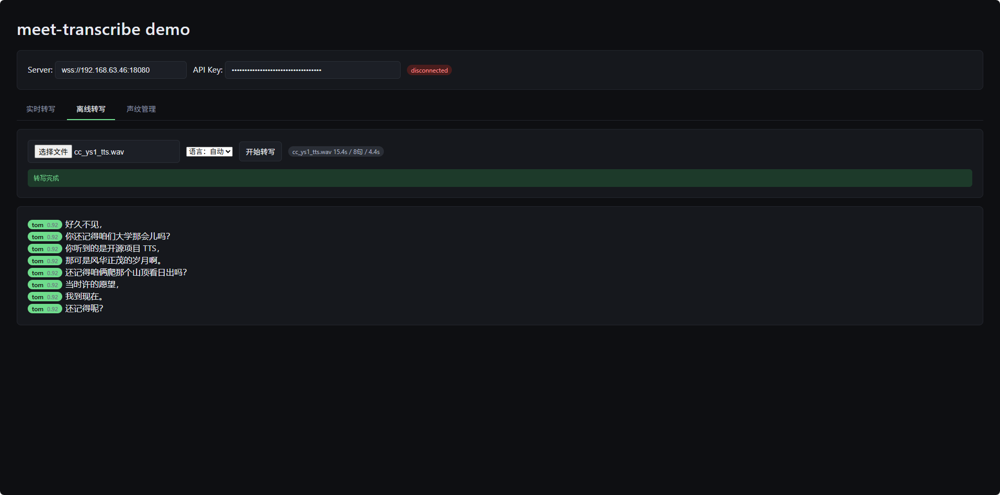
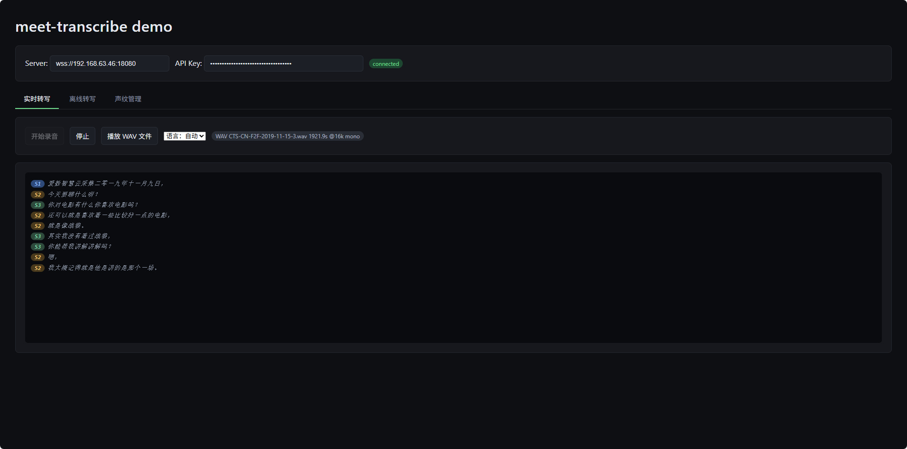

# meet-transcribe

会议场景实时语音转写服务（B2B 私有化部署）。

FunASR 引擎统一处理 ASR + 说话人分离 + 声纹识别，pgvector 做声纹匹配，
FastAPI + WebSocket 提供实时流式转写和离线批转写 API。

## 快速开始

```bash
# Windows 开发环境
py -3.11 -m venv .venv && source .venv/Scripts/activate
pip install -e ".[dev]"
cp configs/meet-transcribe.example.yaml configs/meet-transcribe.yaml
python scripts/run_dev.py
```

首次启动自动下载 FunASR 模型（约 15-30 分钟）。

Web Demo: `http://127.0.0.1:18080/demo`

详细：[Windows 开发指南](docs/dev-windows.md) | [Ubuntu 部署指南](docs/deploy-ubuntu.md)

## 功能

- 实时流式转写（WebSocket，16kHz PCM16）
- 多人说话人分离（FunASR CAM++ 聚类）
- 声纹注册 + 识别（CAM++ embedding + pgvector HNSW）
- 离线文件批转写（WAV/FLAC/OGG/MP3/M4A）
- 多语言支持（auto/zh/en）
- 多租户 + API Key 鉴权

## API

| 端点 | 用途 |
|------|------|
| `GET /v1/ws/transcribe` | 实时流式转写 (WebSocket) |
| `POST /v1/transcribe/file` | 离线文件转写 |
| `POST /v1/speakers` | 声纹注册 |
| `GET /v1/speakers` | 声纹列表 |
| `POST /v1/auth/ticket` | 获取 WebSocket ticket |

详见：[API 对接文档](docs/api.md)

## 架构

```
Browser/Client
    |  WebSocket (PCM int16) / HTTP multipart
    v
FastAPI (ws.py / transcribe.py)
    |
    v
SessionOrchestrator
    |-- FunASR AutoModel (paraformer-zh + VAD + Punc + CAM++)
    |     output: sentence_info[{text, start, end, spk}]
    |-- SpeakerResolver (CAM++ embedding + pgvector match)
          output: speaker_resolved {id, name, score}
```

单引擎架构：模型每 2s 运行一次（ASR + 说话人分离一体），
缓存结果每 500ms 推送到前端。SPK 输出带 per-sentence 文本和 speaker 标签。

### 目录结构

```
src/meet_transcribe/
  api/             FastAPI 路由 + WebSocket + 离线转写
  auth/            API Key + ticket 鉴权
  core/            SessionOrchestrator + FunASR 适配层
  db/              SQLAlchemy 模型 + pgvector
  speakers/        CAM++ 声纹提取 + pgvector 匹配 + 在线 resolver
  config/          YAML + env 配置加载
  observability/   structlog + Prometheus
deploy/
  systemd/         meet-transcribe.service
  scripts/         install.sh / init_schema.sql
web-demo/          测试用 Web 前端（3 标签：实时 / 离线 / 声纹）
configs/           YAML 配置模板
tests/             67 个测试（unit + integration）
docs/              部署 + 对接文档
scripts/           运维脚本 + 验证工具
```

## 配置

关键配置项（`configs/meet-transcribe.yaml`）：

| 字段 | 说明 | 默认值 |
|------|------|--------|
| `asr.model` | 模型档位 | `large` (paraformer-zh) |
| `asr.device` | 推理设备 | `cuda` |
| `speakers.match_threshold` | 声纹匹配阈值 | `0.65` |
| `diarization.enabled` | 启用说话人分离 | `true` |

## 测试

```bash
python -m pytest tests/ -v              # 全部（67 tests）
python -m pytest tests/unit/ -v         # 单元测试
python -m pytest tests/ --cov=src       # 覆盖率
```

### 验证脚本

| 脚本 | 用途 |
|------|------|
| `scripts/verify_speaker_enrollment.py` | 声纹注册 top-1 准确率 |
| `scripts/verify_voiceprint_e2e.py` | 声纹识别端到端 |
| `scripts/test_campp_match.py` | CAM++ 余弦相似度调试 |

## 文档索引

| 文档 | 读者 |
|------|------|
| [API 对接文档](docs/api.md) | 第三方集成方 |
| [管理 API](docs/admin-api.md) | 运维人员 |
| [Ubuntu 部署指南](docs/deploy-ubuntu.md) | 运维人员 |
| [Windows 开发指南](docs/dev-windows.md) | 开发者 |


## Web Demo 测试

 

 

 